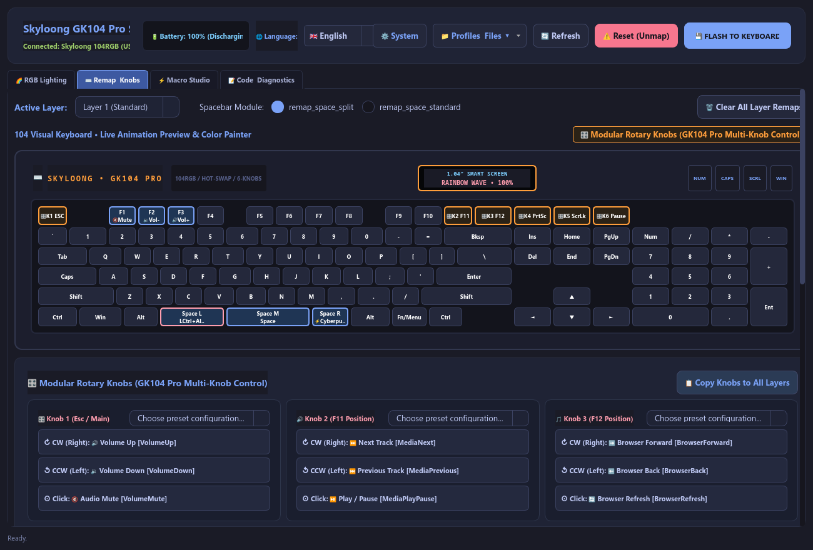
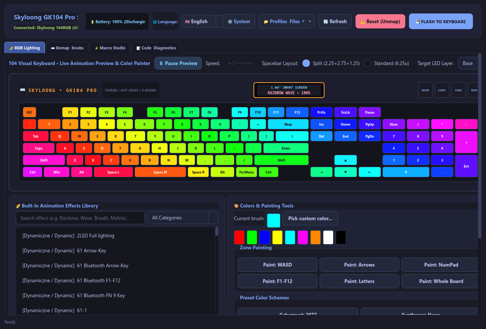
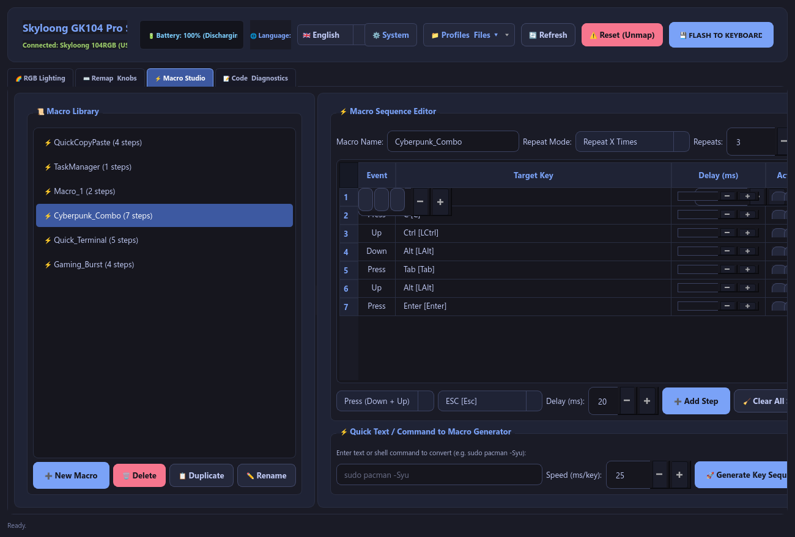
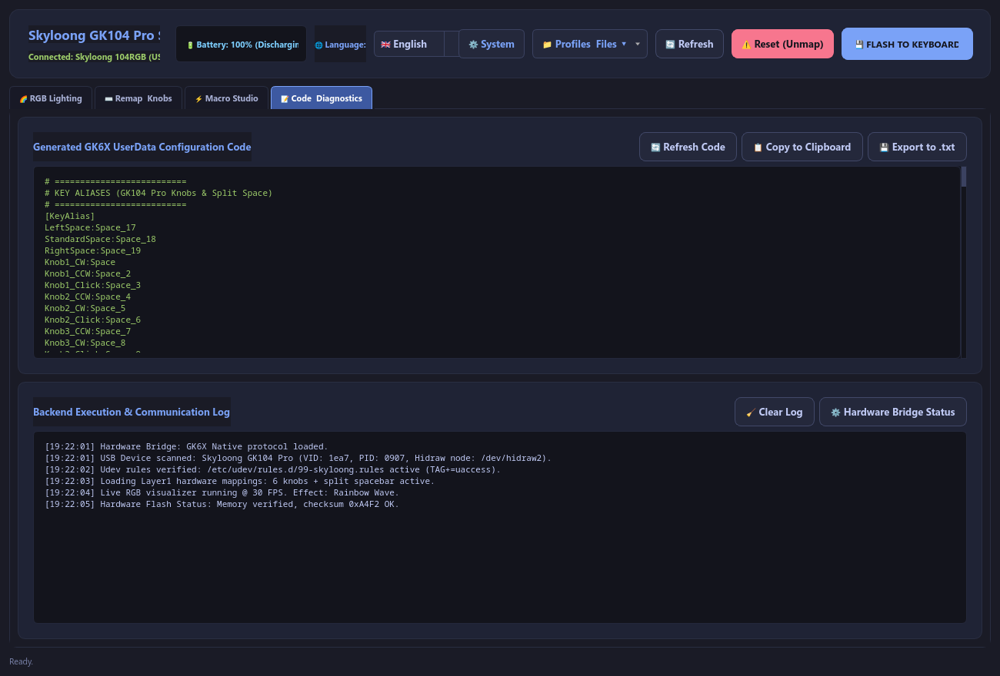
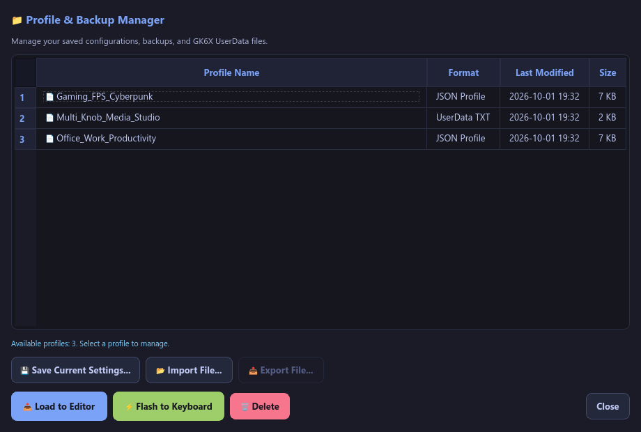
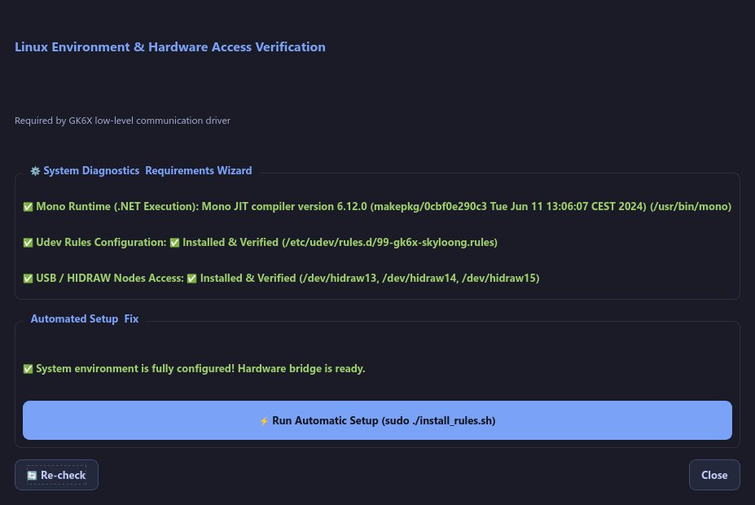

# Skyloong GK104 Pro Studio (Linux) ⌨️ 🌈 🎛️

[](https://www.python.org/)
[](https://pypi.org/project/PySide6/)
[](https://www.kernel.org/)
[](LICENSE)

An advanced, native **Python / PySide6 (Qt6)** graphical utility built for Linux (Arch, CachyOS, Ubuntu, Fedora, openSUSE, Debian) for complete configuration, hardware flashing, key remapping, RGB animation preview, macro programming, and modular rotary knob management for the **Skyloong GK104 Pro (104RGB)** keyboard.

---

> 🌐 **Language Switch / Przełącznik języka:**  
> [🇬🇧 English Documentation](#-english-documentation) | [🇵🇱 Dokumentacja w języku polskim](#-dokumentacja-w-języku-polskim)

---

# 🇬🇧 English Documentation

## 📑 Table of Contents (English)
- [✨ Key Features](#-key-features)
- [📸 Screenshots & Interface Walkthrough](#-screenshots--interface-walkthrough)
- [🛠️ Architecture & Requirements](#️-architecture--requirements)
- [🚀 Quick Start & Installation](#-quick-start--installation)
- [🔧 Hardware Setup & Udev Rules](#-hardware-setup--udev-rules)
- [📁 Configuration & Profile Storage](#-configuration--profile-storage)
- [❓ Troubleshooting & FAQ](#-troubleshooting--faq)

---

## ✨ Key Features

### 1. ⌨️ Full Hardware Key Remapping & Layer Engine
* **Complete Onboard Layer Support:** Seamlessly edit all physical hardware layers:
  * `Base Layer` (Default hardware layout)
  * `Layer 1`, `Layer 2`, `Layer 3` (Onboard onboard profiles)
  * `FnLayer 1`, `FnLayer 2`, `FnLayer 3` (Fn combination layers)
* **Categories matching Official Drivers:**
  * **⌨️ Primary:** Alphanumeric keys (A-Z, 0-9), Function keys (F1–F24), Navigation cluster (Arrows, Home, End, Del, PgUp, PgDn), System modifiers (Ctrl, Shift, Alt, Super/Win).
  * **🔢 Number Pad:** Full Numpad cluster with math operators and Enter.
  * **🎵 Media Controls:** Volume Up/Down/Mute, Play/Pause, Next/Previous track, Stop, Launch Media Player, Eject.
  * **💡 Backlight & LED Control:** Toggle LED, Brightness (+/-), Animation Speed (+/-), Pause/Resume effect, Next RGB Profile, Reactive lighting mode.
  * **🌐 System & Web Navigation:** Calculator, File Manager, Email, Browser actions (Home, Back, Forward, Refresh, Search, Bookmarks), PrintScreen.
  * **🖱️ Mouse Emulation:** Left Click, Right Click, Middle Scroll Click, Mouse Back, Mouse Forward.
  * **⚡ Shortcut Combinations:** Custom modifier combos (e.g. `Ctrl + Alt + T`, `Win + D`, `Ctrl + Shift + Esc`).
  * **📜 Macro Bindings:** Instant binding of any recorded macro to any key or knob event.
  * **🚫 Key Disable:** Complete key deactivation.
* **Layout Switcher:** One-click toggle between standard full spacebar (`6.25u`) and split spacebar (`2.25u + 2.75u + 1.25u`) modules.

---

### 2. 🎛️ Modular Rotary Knobs (GK104 Pro Multi-Knob Support)
* Dedicated configuration for all 6 modular knob sockets on the GK104 Pro (`Esc`, `F11`, `F12`, `PrtSc`, `ScrLk`, `Pause`).
* Independent mapping for:
  * **Rotate Clockwise (CW)** (e.g. Volume Up, Zoom In, Next Tab)
  * **Rotate Counter-Clockwise (CCW)** (e.g. Volume Down, Zoom Out, Prev Tab)
  * **Knob Click / Press** (e.g. Mute, Play/Pause, Reset Zoom)
* **Presets & Quick Sync:** Built-in presets for Volume, Media Player, Web Navigation, Document Zoom, and Tab Switching.
* **Cross-Layer Synchronization:** *"Copy knobs to all layers"* button to instantly propagate knob setups across Base and Layers 1–3.

---

### 3. 🌈 RGB Lighting Studio, Live Animation Engine & Brightness
* **Live Animation Engine (~30 FPS):** Real-time on-screen visualizer simulating active animated effects (Rainbow Wave, Breathing, Windmill, Meteor, Matrix Green, Synthwave, Cyberpunk 2077, Audio Rhythm, and custom color maps).
* **LED Auto-Propagation Fix:** Solves the known firmware issue where lights turn off after flashing by pushing lighting settings simultaneously to all active hardware layers.
* **Per-Key & Zone Painting:** Color individual switches with the native color picker or apply instant color schemes to zones: *WASD*, *Arrows*, *Numpad*, *F-Keys*, *Alphas*, or *Full Board*.
* **Precision Brightness Control:** Hardware luminance slider (0–100%) with quick preset buttons (25%, 50%, 75%, 100%, Off).
* **330+ Built-In Animations:** Filterable animation library categorized for quick selection.

---

### 4. ⚡ Macro Studio & Quick Text Generator
* **Flexible Trigger Modes:**
  * `Repeat X Times` (`RepeatXTimes`)
  * `Hold Key to Repeat` (`ReleaseKeyToStop`)
  * `Toggle On/Off on Press` (`PressKeyAgainToStop`)
* **Step-by-step Sequence Editor:** Configurable `Press`, `Down`, and `Up` events with individual millisecond delay precision and step reordering.
* **Quick Text Generator:** Instantly converts arbitrary text strings or shell commands (e.g. `sudo pacman -Syu`) into precise keydown/keyup sequences with uppercase and symbol handling.
* **Hardware Buffer Protection:** Automatic length validation prevents MCU memory overflow.

---

### 5. 🖥️ KDE Plasma / System Tray Daemon & Power Monitor
* **Battery & Power Monitor:** Real-time monitoring of laptop battery (`BAT0`), AC power supply, and wireless peripherals.
* **Quick Access Context Menu:** Instant switching of brightness levels (100%, 75%, 50%, 25%, 0%), RGB color presets, and active hardware layers without opening the main window.
* **Minimize-to-Tray:** Seamless background operation.

---

### 6. 📁 Profile Management & Direct Hardware Flasher
* **Dual Export / Import System:**
  * **JSON Backup (`.json` / `.gkprofile`):** Complete human-readable backup of layouts, knobs, macros, and RGB configurations.
  * **GK6X UserData (`.txt`):** Raw hardware configuration compatible with low-level GK6X microcontroller flashing routines.
* **One-Click Flash (Apply):** Compiles and flashes configurations directly into the keyboard's onboard EEPROM/Flash memory.

---

### 7. 🌐 Multilingual Language Packs (English & Polish)
* **Built-in Language System:** Complete localization support for **English** (default) and **Polish (Polski)**.
* **Live Language Switcher:** Instant UI language toggling via the top header bar selector and system tray context menu without application restarts.
* **Persistent Preferences:** Automatically saves and restores language selection across application restarts in `~/.config/skyloong_studio/config.json`.

---

## 📸 Screenshots & Interface Walkthrough

| 1. Key Remapping & Modular Rotary Knobs | 2. RGB Lighting Studio & Live Visualizer |
|:---:|:---:|
|  |  |
| *Full visual 104-key layout with amber-highlighted Knob sockets (K1–K6), layers, and categorical inspector.* | *Real-time ~30 FPS animation preview, per-key RGB coloring, zone painter, and brightness slider.* |

| 3. Macro Studio & Text Sequences | 4. Hardware Code Preview & Live Diagnostics |
|:---:|:---:|
|  |  |
| *Macro sequence editor with exact millisecond delays, repeat policies, and Quick Text generator.* | *Live generated GK6X UserData configuration code and backend diagnostic logs.* |

| 5. Profile & Backup Manager | 6. System Diagnostics & Dependency Wizard |
|:---:|:---:|
|  |  |
| *Saved profiles library, import/export options, and one-click hardware flashing.* | *Built-in diagnostics verifying Mono runtime and Linux Udev USB/hidraw permissions.* |

---

## 🛠️ Architecture & Requirements

* **Operating System:** Linux (Kernel 5.15+) — fully tested on CachyOS, Arch Linux, Manjaro, Ubuntu 22.04+, Debian 12+, Fedora 38+, openSUSE.
* **Python Runtime:** Python 3.10 or higher.
* **UI Framework:** PySide6 (Qt 6.5+).
* **Hardware Bridge:** `mono` runtime (for executing the bundled GK6X low-level communication driver).
* **Device Access:** Udev rules granting non-root read/write permissions to USB vendor IDs `1ea7`, `32e3`, `04d9`, `0c45`.

---

## 🚀 Quick Start & Installation

### Option A: Automatic Setup (Recommended)
1. **Clone the repository:**
   ```bash
   git clone https://github.com/kret/Skyloong-Gk104-pro--linux-software.git
   cd Skyloong-Gk104-pro--linux-software
   ```

2. **Install Python dependencies:**
   ```bash
   pip install -r requirements.txt
   ```

3. **Run the application:**
   ```bash
   ./run.sh
   # or
   python3 main.py
   ```
   *If Mono runtime or Udev permissions are missing, the built-in Diagnostic Wizard will prompt you and offer a one-click automated setup.*

---

### Option B: Manual System Setup

#### For Arch Linux / CachyOS / Manjaro:
```bash
sudo pacman -S --needed python python-pip mono
pip install -r requirements.txt
sudo ./install_rules.sh
```

#### For Ubuntu / Debian / Linux Mint:
```bash
sudo apt update
sudo apt install -y python3 python3-pip mono-runtime mono-complete
pip3 install -r requirements.txt
sudo ./install_rules.sh
```

#### For Fedora / RHEL:
```bash
sudo dnf install -y python3 python3-pip mono-core mono-devel
pip install -r requirements.txt
sudo ./install_rules.sh
```

---

## 🔧 Hardware Setup & Udev Rules

For the software to communicate with the GK104 Pro microcontroller over USB without requiring `sudo`, the appropriate Udev rules must be installed.

The `install_rules.sh` script installs `/etc/udev/rules.d/99-skyloong.rules`:
```udev
SUBSYSTEM=="hidraw", ATTRS{idVendor}=="1ea7", MODE="0666", TAG+="uaccess"
SUBSYSTEM=="hidraw", ATTRS{idVendor}=="32e3", MODE="0666", TAG+="uaccess"
SUBSYSTEM=="hidraw", ATTRS{idVendor}=="04d9", MODE="0666", TAG+="uaccess"
SUBSYSTEM=="hidraw", ATTRS{idVendor}=="0c45", MODE="0666", TAG+="uaccess"

SUBSYSTEM=="usb", ATTRS{idVendor}=="1ea7", MODE="0666", TAG+="uaccess"
SUBSYSTEM=="usb", ATTRS{idVendor}=="32e3", MODE="0666", TAG+="uaccess"
SUBSYSTEM=="usb", ATTRS{idVendor}=="04d9", MODE="0666", TAG+="uaccess"
SUBSYSTEM=="usb", ATTRS{idVendor}=="0c45", MODE="0666", TAG+="uaccess"

KERNEL=="hidraw*", ATTRS{idVendor}=="1ea7", MODE="0666", TAG+="uaccess"
KERNEL=="hidraw*", ATTRS{idVendor}=="32e3", MODE="0666", TAG+="uaccess"
KERNEL=="hidraw*", ATTRS{idVendor}=="04d9", MODE="0666", TAG+="uaccess"
KERNEL=="hidraw*", ATTRS{idVendor}=="0c45", MODE="0666", TAG+="uaccess"
```
After installation, reload rules or reconnect the keyboard USB cable:
```bash
sudo udevadm control --reload-rules && sudo udevadm trigger
```

---

## 📁 Configuration & Profile Storage

All local application profiles, active states, and backups are stored in the user directory:
* **Active Profile:** `~/.config/skyloong_studio/profile.json`
* **Saved Profiles Library:** `~/.config/skyloong_studio/profiles/`
* **Log Files:** `~/.config/skyloong_studio/last_flash.log`

---

## ❓ Troubleshooting & FAQ

#### 1. Device status says "Brak połączenia / Permission Denied"
* **Solution:** Ensure udev rules are installed (`sudo ./install_rules.sh`). Unplug and replug the keyboard's USB cable. Check if your user belongs to the `input` or `plugdev` group.

#### 2. Keyboard backlights turn off after flashing
* **Solution:** This software includes automatic multi-layer RGB propagation. Select your desired lighting effect and click *"Wgraj do klawiatury (Apply)"* or use the static color applicator to push the lighting profile across all active hardware layers.

#### 3. Do rotary knobs work in wireless / 2.4G / Bluetooth mode?
* **Solution:** Custom knob remappings and macros are stored directly in the keyboard's onboard microcontroller flash memory, meaning they remain functional across wired USB, 2.4 GHz wireless dongle, and Bluetooth connections on any OS.

---

### 📄 License & Third-Party Credits
* **Project License:** [MIT License](LICENSE)
* **Third-Party Licenses:** Detailed in [THIRD_PARTY_LICENSES.md](THIRD_PARTY_LICENSES.md) (GK6X - MIT, HidSharp - Apache 2.0, PySide6 - LGPLv3).
* Special thanks to the open-source community and the creators of `pixeltris/GK6X`.

---

<br><br>

========================================================================================

# 🇵🇱 Dokumentacja w języku polskim

## 📑 Spis Treści (Polski)
- [✨ Główne Możliwości i Funkcje](#-główne-możliwości-i-funkcje)
- [📸 Galeria Zrzutów Ekranu](#-galeria-zrzutów-ekranu)
- [🛠️ Wymagania Systemowe & Architektura](#️-wymagania-systemowe--architektura)
- [🚀 Szybki Start i Uruchomienie](#-szybki-start-i-uruchomienie)
- [🔧 Konfiguracja Uprawnień USB (Udev) & Mono](#-konfiguracja-uprawnień-usb-udev--mono)
- [📁 Struktura Plików i Profile](#-struktura-plików-i-profile)
- [❓ Najczęściej Zadawane Pytania (FAQ)](#-najczęściej-zadawane-pytania-faq)

---

## ✨ Główne Możliwości i Funkcje

### 1. ⌨️ Zaawansowane Remapowanie Klawiszy i Warstwy Sprzętowe
* **Pełne wsparcie warstw pamięci pokładowej (Onboard):**
  * `Base` (Warstwa domyślna)
  * `Layer 1`, `Layer 2`, `Layer 3` (Warstwy sprzętowe)
  * `FnLayer 1`, `FnLayer 2`, `FnLayer 3` (Warstwy wywoływane klawiszem `Fn`)
* **Kategorie przypisań w pełni zgodne z oficjalnym sterownikiem:**
  * **⌨️ Primary (Klawisze Główne):** Alfanumeryczne (A-Z, 1-0, znaki specjalne), F1–F24, Nawigacja (Strzałki, Home, End, Del, PgUp/Dn), Modyfikatory (Ctrl, Shift, Alt, Super/Win).
  * **🔢 Number Pad (Klawiatura Numeryczna):** Pełny blok numeryczny z operatorami matematycznymi.
  * **🎵 Media (Multimedia i Dźwięk):** Głośność +, Głośność -, Wyciszenie, Odtwarzaj/Pauza, Następny/Poprzedni utwór, Stop, Uruchomienie odtwarzacza, Eject.
  * **💡 Light / Backlight (Sterowanie Oświetleniem):** Włącz/Wyłącz LED, Jasność +/-, Prędkość animacji +/-, Pauza/Wznowienie, Następny profil RGB, Tryb reakcji na kliknięcia.
  * **🌐 System / Net (System i Internet):** Kalkulator, Menedżer plików (Mój Komputer), Poczta, Nawigacja przeglądarki (Home, Wstecz, Dalej, Odśwież, Szukaj, Ulubione), Zrzut ekranu (PrtSc).
  * **🖱️ Mouse (Emulacja Myszy):** Lewy klik, Prawy klik, Środkowy klik (Scroll), Przycisk Wstecz, Przycisk Dalej.
  * **⚡ Kombinacje / Skróty:** Dowolne kombinacje klawiszy z modyfikatorami (`Ctrl`, `Shift`, `Alt`, `Super`) oraz popularne skróty systemowe.
  * **📜 Makra:** Bezpośrednie przypisanie dowolnego nagranego makra do wybranego klawisza lub kierunku obrotu pokrętła.
  * **🚫 Wyłącz (Disable):** Całkowite dezaktywowanie wybranego klawisza.
* **Przełącznik modułu Spacji:** Szybka zmiana widoku i mapowania pomiędzy pełną spacją (`6.25u`) a modułem dzielonym Split Spacebar (`2.25u + 2.75u + 1.25u`).

---

### 2. 🎛️ Obsługa Modularnych Pokręteł (Rotary Knobs — GK104 Pro)
* Dedykowana obsługa do 6 modularnych pokręteł w gniazdach GK104 Pro (`Esc`, `F11`, `F12`, `PrtSc`, `ScrLk`, `Pause`).
* Niezależna konfiguracja 3 akcji dla każdego pokrętła:
  * **Obrót w prawo (CW)** (np. Głośność +, Zoom +, Następna karta)
  * **Obrót w lewo (CCW)** (np. Głośność -, Zoom -, Poprzednia karta)
  * **Wciśnięcie (Click)** (np. Wyciszenie, Play/Pause, Reset Zoomu)
* **Gotowe profile pokręteł:** Głośność, Odtwarzacz multimedialny, Przeglądanie stron WWW, Zoom dokumentów, Przełączanie kart.
* **Synchronizacja międzywarstwowa:** Przycisk *"Skopiuj te pokrętła na wszystkie warstwy"* – sprawia, że pokrętła zachowują spójne działanie na wszystkich profilach sprzętowych.

---

### 3. 🌈 Studio Oświetlenia LED, Płynny Podgląd Animacji & Jasność
* **Silnik animacji na żywo (~30 FPS):** Realistyczny podgląd renderowany w czasie rzeczywistym bezpośrednio na wirtualnej klawiaturze (Fala Tęczy, Oddychanie, Wiatrak, Meteor, Matrix Green, Cyberpunk 2077, Synthwave Neon, Rytm dźwięku).
* **Automatyczna naprawa gaśnięcia LED:** Prawidłowa propagacja ustawień podświetlenia na wszystkie warstwy sprzętowe, co eliminuje problem wyłączania diod po zaprogramowaniu.
* **Malowanie strefowe i Per-Key RGB:** Precyzyjne kolorowanie pojedynczych przełączników lub natychmiastowe nakładanie barw na strefy: *WASD*, *Strzałki*, *NumPad*, *F1-F12*, *Litery* lub *Całość*.
* **Suwak i szybkie poziomy jasności:** Precyzyjny suwak luminancji (0–100%) oraz przyciski 25%, 50%, 75%, 100% i Wyłącz.
* **Biblioteka ponad 330 efektów:** Wbudowana, przeszukiwalna lista animacji z podziałem na kategorie.

---

### 4. ⚡ Menedżer Makr (Macro Studio) & Generator Tekstu
* **3 Tryby powtarzania makr:**
  * `Wykonaj X razy` (`RepeatXTimes`)
  * `Powtarzaj przy trzymaniu klawisza` (`ReleaseKeyToStop`)
  * `Włącz / Wyłącz ponownym naciśnięciem - Toggle` (`PressKeyAgainToStop`)
* **Edytor sekwencji:** Zdarzenia typu `Press` (Naciśnij i puść), `Down` (Wciśnij i przytrzymaj), `Up` (Puść) z dokładnością do 1 milisekundy.
* **Szybki generator tekstu (Quick Text):** Wpisz dowolny tekst lub polecenie powłoki (np. `sudo pacman -Syu`), a aplikacja wygeneruje pełną sekwencję naciśnięć klawiszy z obsługą wielkich liter i znaków specjalnych.
* **Zabezpieczenie pamięci:** Automatyczna kontrola rozmiaru bufora zapobiegająca błędowi przepełnienia pamięci kontrolera.

---

### 5. 🖥️ Integracja z Pulpitem KDE / Zasobnik Systemowy (Tray)
* **Monitor zasilania i baterii:** Odczyt stanu naładowania baterii laptopa (`BAT0`), zasilacza i urządzeń peryferyjnych na żywo.
* **Szybkie menu kontekstowe:** Błyskawiczna zmiana jasności podświetlenia (100%, 75%, 50%, 25%, 0%), motywów RGB oraz przełączanie aktywnych warstw bez otwierania okna głównego.
* **Praca w tle:** Opcja minimalizacji do zasobnika systemowego.

---

### 6. 📁 Menedżer Profili & Programator Pamięci Flash
* **Zapis i eksport konfiguracji:**
  * **Kopia JSON (.json / .gkprofile):** Kompletny zapis układów, pokręteł, makr i kolorystyki RGB.
  * **Kod sprzętowy (.txt UserData):** Format zgodny z niskopoziomowym protokołem mikrokontrolera GK6X.
* **Przycisk "Wgraj do klawiatury" (Apply):** Kompilacja i bezpośredni zapis do pamięci Flash/EEPROM klawiatury.

---

### 7. 🌐 Obsługa Paczek Językowych (Angielski i Polski)
* **Wbudowane wsparcie wielojęzyczne:** Kompletna lokalizacja w języku **angielskim** (domyślnym) oraz **polskim**.
* **Przełącznik w czasie rzeczywistym:** Natychmiastowa zmiana języka interfejsu z poziomu paska nagłówka oraz menu zasobnika systemowego (tray) bez konieczności restartu programu.
* **Automatyczne zapamiętywanie:** Wybrany język jest automatycznie zapisywany w `~/.config/skyloong_studio/config.json`.

---

## 📸 Galeria Zrzutów Ekranu

| 1. Remapowanie Klawiszy i Modularne Pokrętła | 2. Studio Oświetlenia LED & Podgląd na Żywo |
|:---:|:---:|
|  |  |
| *Wizualna klawiatura 104 z bursztynowym wyróżnieniem gniazd pokręteł (K1–K6), warstwami i inspektorem.* | *Silnik podglądu animacji ~30 FPS, malowanie strefowe, per-key RGB i regulacja jasności.* |

| 3. Menedżer Makr (Macro Studio) | 4. Podgląd Kodu Sprzętowego & Diagnostyka |
|:---:|:---:|
|  |  |
| *Kreator sekwencji makr z precyzyjnymi opóźnieniami w ms, trybami powtarzania i generatorem tekstu.* | *Podgląd wygenerowanego kodu GK6X UserData w czasie rzeczywistym oraz logi wykonania.* |

| 5. Menedżer Profili i Kopii Zapasowych | 6. Asystent Diagnostyki & Instalator Uprawnień |
|:---:|:---:|
|  |  |
| *Biblioteka zapisanych profili, import/eksport plików JSON i programowanie pamięci flash.* | *Wbudowany asystent weryfikujący środowisko Mono oraz uprawnienia reguł Udev.* |

---

## 🛠️ Wymagania Systemowe & Architektura

* **System Operacyjny:** Linux (Kernel 5.15+) — przetestowano na CachyOS, Arch Linux, Manjaro, Ubuntu 22.04+, Debian 12+, Fedora 38+, openSUSE.
* **Środowisko Python:** Python 3.10 lub nowszy.
* **Biblioteka GUI:** PySide6 (Qt 6.5+).
* **Mostek Sprzętowy:** Środowisko `mono` (wymagane do uruchomienia modułu komunikacji niskopoziomowej GK6X).
* **Dostęp do urządzeń:** Reguły Udev dla urządzeń USB / hidraw (`1ea7`, `32e3`, `04d9`, `0c45`).

---

## 🚀 Szybki Start i Uruchomienie

### Metoda A: Szybkie Uruchomienie (Zalecana)
1. **Pobierz repozytorium:**
   ```bash
   git clone https://github.com/kret/Skyloong-Gk104-pro--linux-software.git
   cd Skyloong-Gk104-pro--linux-software
   ```

2. **Zainstaluj zależności Pythona:**
   ```bash
   pip install -r requirements.txt
   ```

3. **Uruchom program:**
   ```bash
   ./run.sh
   # lub
   python3 main.py
   ```
   *W przypadku braku środowiska Mono lub reguł Udev, aplikacja automatycznie wyświetli Asystenta Instalacji i zaproponuje konfigurację jednym kliknięciem.*

---

### Metoda B: Ręczna Instalacja Zależności w Dystrybucjach Linux

#### Arch Linux / CachyOS / Manjaro:
```bash
sudo pacman -S --needed python python-pip mono
pip install -r requirements.txt
sudo ./install_rules.sh
```

#### Ubuntu / Debian / Linux Mint:
```bash
sudo apt update
sudo apt install -y python3 python3-pip mono-runtime mono-complete
pip3 install -r requirements.txt
sudo ./install_rules.sh
```

#### Fedora / RHEL:
```bash
sudo dnf install -y python3 python3-pip mono-core mono-devel
pip install -r requirements.txt
sudo ./install_rules.sh
```

---

## 🔧 Konfiguracja Uprawnień USB (Udev) & Mono

Aby aplikacja mogła programować pamięć klawiatury bez konieczności uruchamiania z uprawnieniami roota (`sudo`), instalowane są reguły w `/etc/udev/rules.d/99-skyloong.rules`:

```bash
sudo ./install_rules.sh
```

Po instalacji przeładuj reguły udev lub odłącz i podłącz ponownie kabel USB klawiatury:
```bash
sudo udevadm control --reload-rules && sudo udevadm trigger
```

---

## 📁 Struktura Plików i Profile

Wszystkie lokalne profile użytkownika, kopie zapasowe i logi przechowywane są w katalogu domowym:
* **Główny profil:** `~/.config/skyloong_studio/profile.json`
* **Katalog profili:** `~/.config/skyloong_studio/profiles/`
* **Log ostatniego programowania:** `~/.config/skyloong_studio/last_flash.log`

---

## ❓ Najczęściej Zadawane Pytania (FAQ)

#### 1. Komunikat "Brak połączenia / Permission Denied" w pasku stanu
* **Rozwiązanie:** Upewnij się, że zainstalowano reguły udev (`sudo ./install_rules.sh`) oraz przepnij kabel USB. Sprawdź czy Twój użytkownik należy do grupy `input` lub `plugdev`.

#### 2. Czy zaprogramowane pokrętła i makra działają bezprzewodowo (2.4G / Bluetooth)?
* **Rozwiązanie:** Tak! Zapis konfiguracji następuje w pamięci Flash mikrokontrolera klawiatury, dzięki czemu wszystkie mapowania, pokrętła i makra działają w każdym trybie łączności (USB, 2.4 GHz, BT) na dowolnym komputerze.

#### 3. Podświetlenie klawiatury gaśnie po zaprogramowaniu
* **Rozwiązanie:** Aplikacja posiada wbudowaną automatyczną propagację parametrów RGB na wszystkie warstwy sprzętowe. Wybierz żądany profil oświetlenia i kliknij *"Wgraj do klawiatury (Apply)"*.

---

### 📄 Licencja & Podziękowania
* **Licencja projektu:** [MIT License](LICENSE)
* **Licencje komponentów zewnętrznych:** Szczegółowe zestawienie znajduje się w pliku [THIRD_PARTY_LICENSES.md](THIRD_PARTY_LICENSES.md) (GK6X - MIT, HidSharp - Apache 2.0, PySide6 - LGPLv3).
* Podziękowania dla społeczności open-source oraz twórców narzędzia `pixeltris/GK6X` za opracowanie protokołu komunikacji z kontrolerami klawiatur Semitek/Skyloong.
